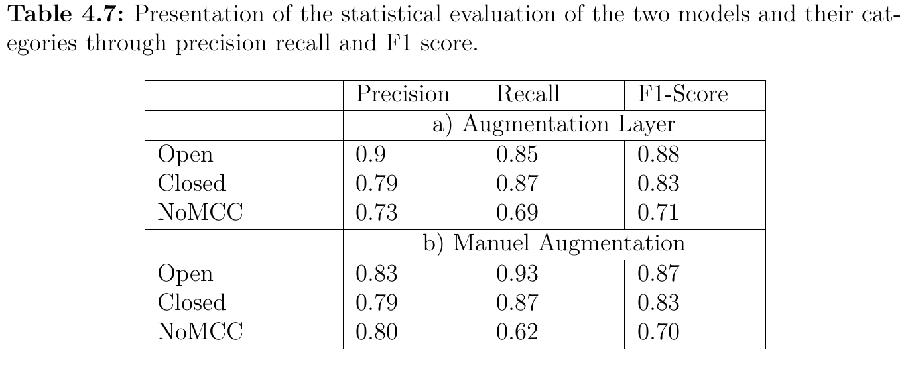
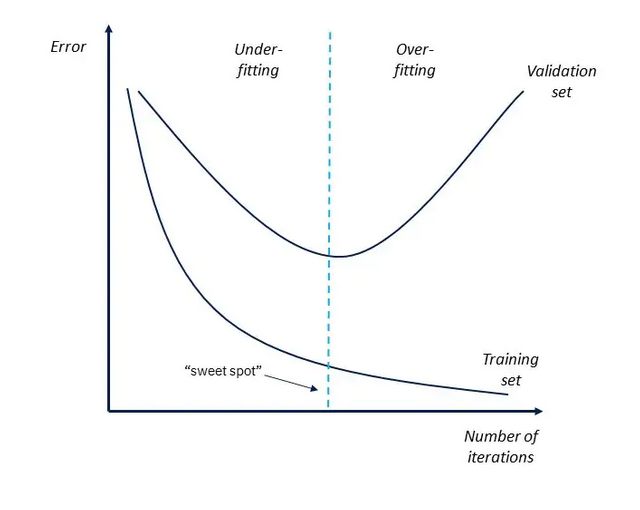

# How to create a new model?

# Description

How to create a new model?

To create and train a new model, the model configurations of model_group.py can be used, adjusted and executed. There you can find the model configuration for the original dataset with an augmentation layer as well as the configuration with an already augmented dataset. These configurations worked best for the respective dataset, but can also be used for other dataset.

Recommendation: For the beginning you should work with the original dataset and the augmentation layer configuration, because it is very simple and does not need so much computing power and still could achieve an equivalent result. (see Master_Thesis.pdf)

What are the actual models able to predict?

- The models can predict open and closed MCC with high accuracy.
- The models are trained to additionally detect scenes that do not meet the criteria of open and closed low-level scenes (noMCC).
- However, the accuracy in the noMCC case is lower and the models are therefore not capable of predicting noMCC scenes, but the noMCC classification is used as not open or closed MCC classification.
### Statistics of Models 

Both models have similar precision, recall, and F1-score. Thus, both models can be used to predict open and closed MCC with an overall accuracy of 80.6%. While the Model1 with the automatic data augmentation has a higher precision in open MCC, the Model2 with the manual data augmentation has a higher recall of open MCC. This means that while the Model1 has predicted fewer open MCC correctly as open MCC, it has categorized also fewer other categories as open MCC, leading to a higher precision of open MCC with a lower recall (see also Fig. 4.7 in *Master_Thesis.pdf*). In contrast, Model2 has predicted a higher number of open MCC correctly as open, but also more noMCC cases are predicted as open MCC, leading to a lower precision and a higher recall of open MCC (see also Fig. 4.7 in *Master_Thesis.pdf*). However, most noMCC scenes, that are identified as open, could also by eye be identified as open, but might not match the 70% criteria of the visual inspection (see Fig. 4.9 in *Master_Thesis.pdf*). Therefore, we trust both models to predict open and closed MCC with high accuracy, in case the precision of open and closed MCC is particularly important we recommend using the Model1. A more detailed description about the prediction of the models can be seen in the repository "Reichel11/Prediction".
      

# Configurations

What are the least configurations that should be given?

- There should be at least one convolutional layer with relu activation function and maxpooling layer.
- There should be a flattening layer followed by at least one dense layer with softmax activation function. (size of last dense layer should equals the number of categories)
- The Adam optimizer as well as the categorical_crossentropy loss function should be set.
- the loss function applies to three or more categories. If there are only two categories, the line should be changed to loss = "binary_crossentropy".

What can be added and changed?

- Which variables can be changed as needed?

     - batch_size, epochs, learning_rate, validation_split, filter and kernel size.
     - Recommended values: batch_size = 20; epochs = 50; learning_rate = 0.001; validation_split = 0.3; filterize = 128 ,64 or 32; kernelsize= 3,3

- What additional layers can be added?

     - Additional convolutional layer (with relu activation function and maxpooling layer)
     - Additional dense layer with relu activation function
     - Dropout layer (after maxpooling layer or mense layer), but not after the last dense layer
     - Batch_normalization layer
     - L2_regularizer (kernel and bias regularizer)
     - Recommended values: convolution layer (filter size = 128,64,32, kernel size = 3,3); dense layer (64 or other value, but from a higher to a lower value);           dropout (0.3-0.5); L2_regularizer (0.01).    

# How to avoid Overfitting

In a neural network, problems can occur that include underfitting and overfitting.
The figure below shows the loss function of the training and validation dataset to illustrate
what is the meaning of underfitting and overfitting. The dashed blue line represents
the desired point at which the loss has found its minimum. To the left of this point is
the area of underfitting, where the loss tries to minimize itself. Accordingly, the model
has not yet been trained with enough data or has not had enough time to train and
has not yet reached the desired point. The overfitting area is on the opposite side. The
model has learned the features of the training set too well and is therefore less able
to assign the features of the validation set (IBM, 2021; Bishop, 2016). Therefore, it is
important to avoid overfitting and in the following are a few regularizatrion methods
to prevent this.

### Overfitting and Underfitting 

### Regularization methods 

In the following are some regularization methods I used explained. For more details, see Master_Thesis.pdf

1) Dropout

- used to ignore random correlations between the data
- it removes certain values from the network

2) L2 regularizer

- calibrate machine learning models in order to minimize the adjusted loss function
- shrinks weights to small values
- well suited for overfitting

3) Batch normalization

- normalizes the contributions to a layer for every mini-batch
- decreasing the number of training epochs
- makes the model more stable

4) Data augmentation

- increasing the number of the actual dataset by making small changes to the images (such as roating, zooming, cropping)
- more data improves the model and therefore less overfitting

# Improvement Ideas

A closer examination of the no MCC scenes revealed that some of the images classified into no MCC had features
of open or closed cell structures, which is a possible explanation for the difficulty of the models to classify them correctly.
To avoid this, it would be possible in future work to reclassify the no MCC dataset to remove all scenes with obvious open and closed MCC cloud structures. Furthermore, it would also be possible to generate smaller scenes from the existing images that are still large enough to recognize the necessary structures, but small enough so that there are no different structures in one image. A different approach could be to introduce additional categories for scenes with features of more than one type of MCC clouds.

For future work with the actual dataset, it is therefore highly recommended to first address the problem of the incorrect noMCC assignment. Only then should different model configurations be tried out.

# Technical Requirements
Python (version 3.7) is required to use the models. Furthermore the installation of the following packages is necessary:
- Tensorflow – 2.7.0
- Keras – 2.6.0
- Pickleshare – 0.7.5
- Numpy – 1.19.5
- Matplotlib – 3.1.3
